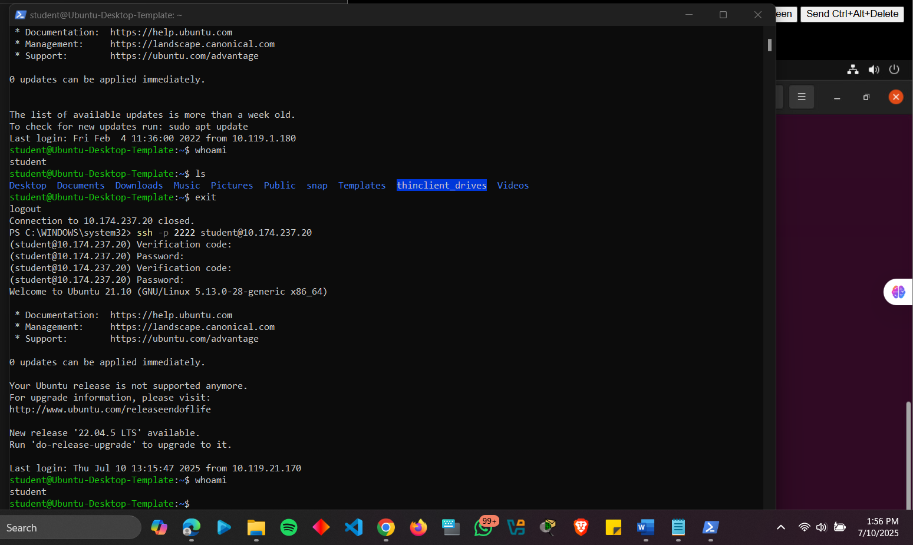

# Fundamental Linux Security: SSH with Multi-Factor Authentication

This repository documents a hands-on project to configure **multi-factor authentication (MFA)** for SSH access on an Ubuntu Desktop VM. The system was placed behind a pfSense firewall, with port forwarding enabled for secure remote access.

---

## **Project: Linux SSH with MFA (Google Authenticator)**
### **Overview**
Configured an Ubuntu Desktop VM to enforce **multi-factor authentication (MFA)** for SSH using Google Authenticator. The project demonstrates secure remote administration by combining password-based authentication with time-based one-time passwords (TOTP).

---

### **Configuration & Screenshots**

#### 1. Ubuntu Setup
- Installed Ubuntu Desktop on vSphere and named the VM **`Ubuntu-secure-237`**  
- Assigned the VM to the LAN network behind pfSense  
- Configured a static IP: `172.16.237.33`  

  
*Ubuntu VM configured with static IP 172.16.237.33*

---

#### 2. Port Forwarding on pfSense
- Created a NAT rule to forward **WAN port 2222** to the Ubuntu VM’s SSH port (**22**)  

  
*pfSense NAT rule forwarding WAN port 2222 to Ubuntu VM’s SSH service*

---

#### 3. System Updates
- Ran `sudo apt update && sudo apt upgrade -y`  
- Ensured the system was fully up to date  

  
*Ubuntu packages successfully updated and upgraded*

---

#### 4. SSH and MFA Configuration
- Installed required packages: `openssh-server` and `libpam-google-authenticator`  
- Generated secret key and emergency scratch codes using **Google Authenticator**  
- Modified `/etc/pam.d/sshd` and `/etc/ssh/sshd_config` to enforce MFA  
- Restarted the SSH service to apply changes  

  
*Google Authenticator secret key and emergency codes generated*

---

#### 5. Testing SSH with MFA
- Connected from a remote Windows machine via SSH on port **2222**  
- Verified MFA by entering both **password** and **verification code** from the app  

  
*Remote SSH login requiring both password and Google Authenticator verification code*

---

### **Observations and Challenges**
1. **Ubuntu Version Issue:** The initial VM version (21.10) caused compatibility problems with required packages. Upgrading resolved the issue.  
2. **SSH Configuration:** The connection failed until `ChallengeResponseAuthentication yes` was added in `sshd_config` and the SSH service was restarted.  
3. **Security Benefits:** MFA significantly enhances SSH security but requires precise configuration to work correctly.  

---

### **Additional SSH Security Enhancements**
1. **Disable Password Authentication:** Use SSH key-based authentication only to prevent brute-force attacks.  
2. **Change Default SSH Port:** Reduce exposure to automated scans by using a non-standard port (e.g., 2222).  
3. **Implement Fail2Ban:** Automatically block IP addresses after repeated failed login attempts.  

---

### **Role of `sudo` in Secure Administration**
- `sudo` allows authorized users to execute commands as root while maintaining accountability.  
- Security Benefits:  
  - Limits direct root access  
  - Logs all privileged commands  
  - Requires authentication, ensuring proper user responsibility  
- This minimizes risks of accidental or malicious system changes.  

---

### **How to Reproduce**
1. **Requirements:**  
   - pfSense firewall with WAN/LAN interfaces  
   - Ubuntu Desktop VM with static IP behind LAN  
   - Remote Windows client with SSH client installed  

2. **Steps:**  
   ```bash
   # On Ubuntu VM:
   1. sudo apt update && sudo apt upgrade -y
   2. sudo apt install openssh-server libpam-google-authenticator -y
   3. google-authenticator  # Generate key & emergency codes
   4. Edit /etc/pam.d/sshd to include: auth required pam_google_authenticator.so
   5. Edit /etc/ssh/sshd_config:
      ChallengeResponseAuthentication yes
      PasswordAuthentication yes
      UsePAM yes
   6. sudo systemctl restart ssh

   # On pfSense:
   7. Firewall > NAT > Add Port Forward (WAN:2222 → LAN:22)

   # On Windows client:
   8. ssh user@<WAN-IP> -p 2222
   9. Enter password + verification code from Google Authenticator
